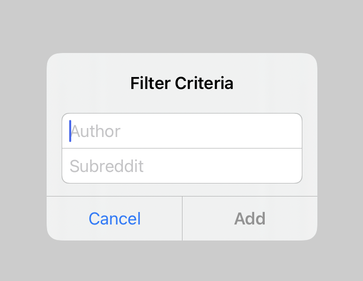

# 🍅 FancyTextEntryController



A simpler/easier API for adding text fields to `UIAlertController`s. Not a custom view, just uses good ol' `UIAlertController`.

- Easy text field validation. Specify `none`, or a length range (e.g.: `2 ..< 10`) and only text that is between >= 2 and <= 9 characters long will be accepted, or finally a regular expression option that will let you specify a pattern for validation, for instance if you want to allow alphanumerics, but not whitespace. If the text isn't valid, the "Add" button is disabled
- Less boilerplate code
- This validation applies to multiple text fields, not only one
- Makes the font of the text fields a bit larger/easier to see

## Example

Create it, add some text fields, then present it.

```swift
let alertController = FancyTextEntryController.create(withTitle: "Filter Criteria") { controller in
    let text1 = controller.text(forTextFieldAtIndex: 0)
    let text2 = controller.text(forTextFieldAtIndex: 1)
    
    print("Tapped add with text: \(text1), \(text2)")
}

alertController.addTextField(withPrepopulatedText: nil, placeholder: "Author", validation: .regex(pattern: #"^\w+$"#, lengthRange: 2 ..< 25), keyboardType: .default)
alertController.addTextField(withPrepopulatedText: nil, placeholder: "Subreddit", validation: .regex(pattern: #"^\w+$"#, lengthRange: 2 ..< 25), keyboardType: .default)

present(alertController, animated: true, completion: nil)
```

## Installation

Drag and drop `FancyTextEntryController.swift` into your project. When the code is this small and simple it becomes yours to raise as your child, no need for package managers!
